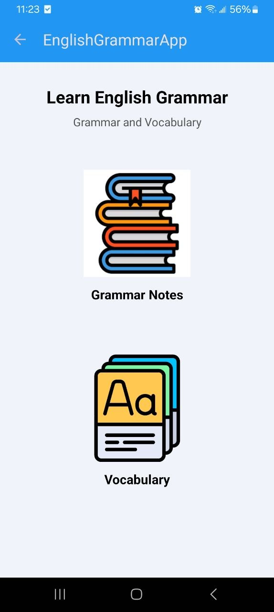
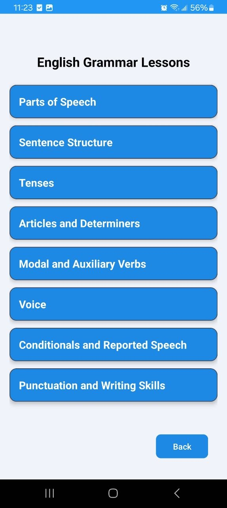
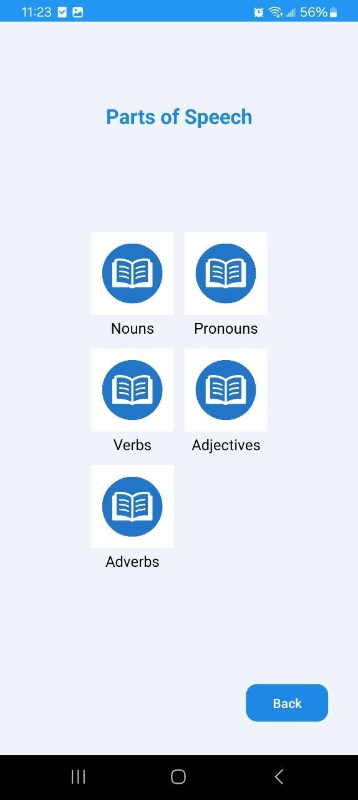
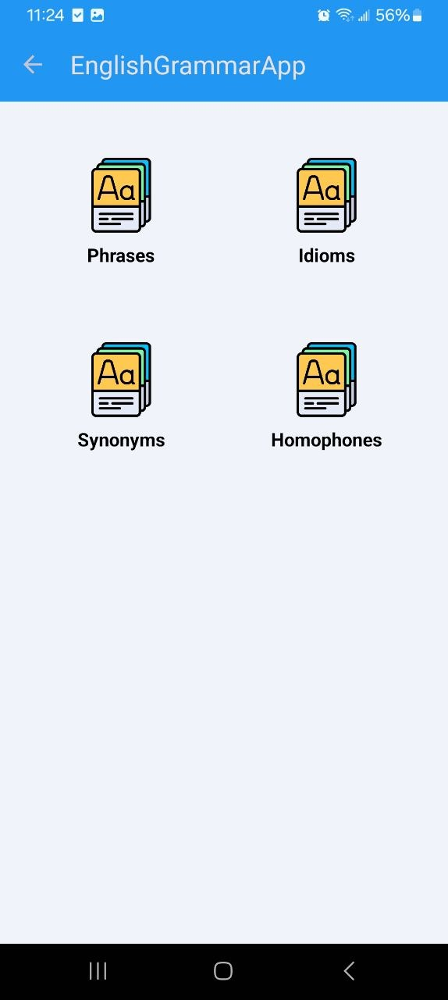
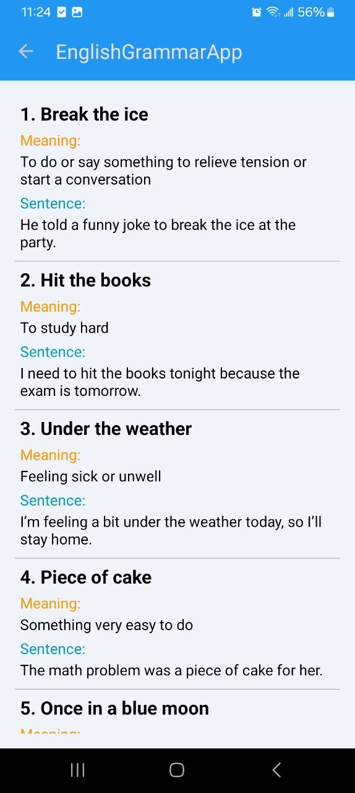

# 📚 English Grammar App

A native Android application for learning and practicing English grammar and vocabulary through a simple and user-friendly mobile interface.

## Features

* Browse English grammar lessons
* Explore grammar topics
* Learn vocabulary by topic
* View vocabulary words and their details
* Simple and user-friendly Android interface
* Easy navigation between learning sections

## Technologies

* **Java**
* **Android SDK**
* **AndroidX**
* **Material Components**
* **ConstraintLayout**
* **Gradle**
* **Android Studio**

## 📱 Application Structure

The application contains several main activities:

* `MainActivity` — Main application screen
* `LessonsActivity` — Grammar lessons
* `TopicsActivity` — Grammar topics
* `DetailActivity` — Detailed lesson/topic information
* `VocabularyTopicsActivity` — Vocabulary categories
* `VocabularyWordsActivity` — Vocabulary words
* `Word` — Vocabulary word model

## Getting Started

### Prerequisites

Before running the project, make sure you have:

* Android Studio installed
* JDK 11 or compatible Java environment
* Android SDK
* Android device or Android Emulator

### Installation

1. Clone the repository:

```bash
git clone git@github.com:sebrinamusbah/english-grammar-app.git
```

2. Open the project in **Android Studio**.

3. Allow Gradle to synchronize and download the required dependencies.

4. Connect an Android device or start an Android Emulator.

5. Run the application from Android Studio.

## Build from Command Line

To build the debug version:

```bash
./gradlew assembleDebug
```

The generated APK will be available under:

```text
app/build/outputs/apk/debug/
```

## 📂 Project Structure

```text
EnglishGrammarApp/
├── app/
│   ├── src/
│   │   ├── main/
│   │   │   ├── java/
│   │   │   ├── res/
│   │   │   └── AndroidManifest.xml
│   │   ├── androidTest/
│   │   └── test/
│   ├── build.gradle.kts
│   └── proguard-rules.pro
├── gradle/
├── screenshots/
│   ├── main-screen.png
│   ├── lessons.png
│   ├── grammar-topics.png
│   ├── vocabulary-topics.png
│   └── vocabulary-words.png
├── build.gradle.kts
├── gradle.properties
├── gradlew
├── gradlew.bat
├── settings.gradle.kts
└── README.md
```

## 📸 Screenshots

<p align="center">
  
  
  
</p>

<p align="center">
  
  
</p>

## 👩‍💻 Developer

**Sebrina Musbah**

Software Engineering Student | Full-Stack Developer | AI Enthusiast

GitHub: [@sebrinamusbah](https://github.com/sebrinamusbah)

## 📄 License

This project is available for educational and portfolio purposes.
